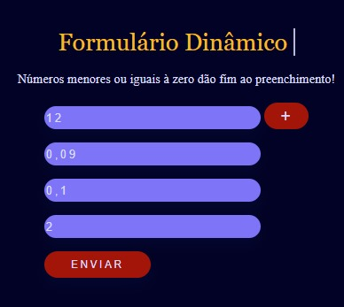
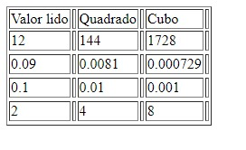

# Formulários Dinâmicos - PHP
## Objetivo:

Esse projeto teve como objetivo demonstrar, utilizar e aprofundar conhecimentos relacionados à interligação de linguagns diferentes em prol da realização de algo, 
assim como de usurfruir de técnicas relacionadas a dinamização de um projeto, principalmente apartir do uso de JavaScript com a geração de campos e tags HTML. 
Por fim, também foi possível o aprofundamento de conhecimentos relacionados à tratamento de dados do cliente pelo servidor, assim como conceitos e tratamento de matrizes(arrays) a partir do uso do PHP.

### Screenshot da interface web inicial do projeto(Client-Side):
Assim que o usuário acessa a aplicação é essa a interface que se apresenta

### Screenshot da interface web do projeto preenchida(Client-Side):
Funcionalidades de tratamento de elementos html feito com JavaScript

### Screenshot da tabela resultante do tratamento de dados feito pelo PHP(Server-Side):
Resultado do tratamento de Dados obtidos a partir do client-side e retornado com PHP

## Instruções de Uso:

Só são aceitos números naturais maiores que zero!

Ao inserir um número menor ou igual a zero no último input adinado e clicar no botão de '+' e posteriormente no botão de 'Enviar',
o usuário será redirecionado à uma tabela contendo: Os numeros inseridos, os numeros inseridos elevados ao quadrado e por fim os numeros inseridos elevados ao cubo. 

## Observação:

Infelizmente não é possivel deixar um link para que acessem essa aplicaçõ online, já que no momenento não possuo nenhum construtor de sites que suportam PHP.
